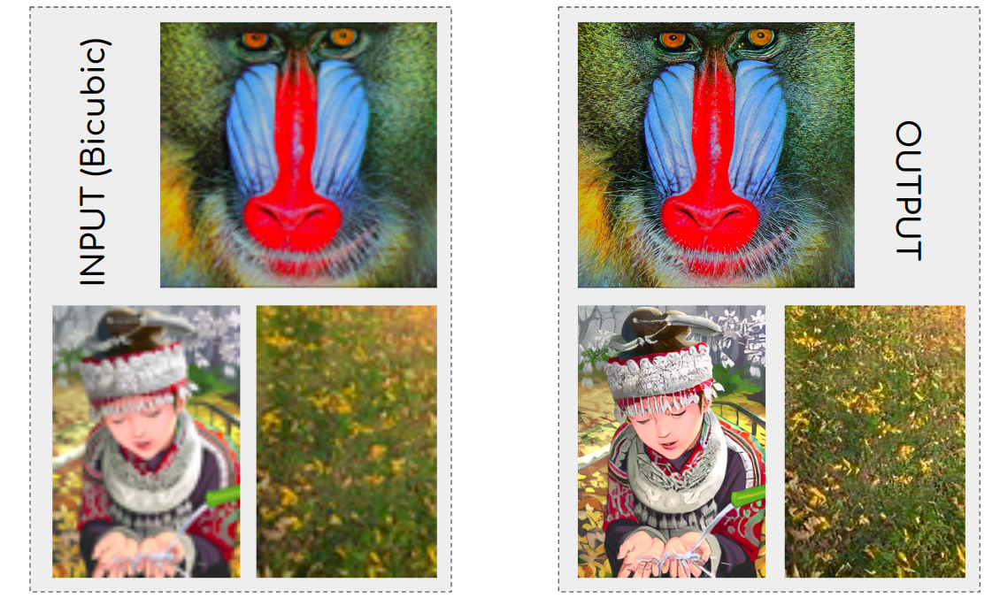

# ESR GAN (Enhanced Super-Rosolution Generative Adversarial Network

## What is it ? 
* Enhanced Super-Resolution Generative Adversarial Networks (ESRGAN) is a state-of-the-art neural network architecture designed to produce high-quality, high-resolution images from low-resolution inputs.
It extends upon the original Super-Resolution Generative Adversarial Network (SRGAN) by introducing several key improvements. 
    - Super-resolution is the process of enhancing the resolution of an image, increasing its quality and details. It has applications in various fields, including medical imaging, satellite imagery, and more. 
    - GANs consist of two networks, a generator and a discriminator, that are trained simultaneously. The generator aims to create realistic images, while the discriminator attempts to distinguish between real images and those produced by the generator.
 
### Libraries used
 - torch | torchvision | tqdm | sys | OpenCV | albumentations | PIL | numpy | os | time

### Languages used
 - Python


## Its Components
  1. Residual-in-Residual Dense Block (RRDB):
       - Residual Block: Helps in preserving information across layers, which is crucial for maintaining image details. 
       - Dense Block: Each layer in a dense block receives input from all previous layers, leading to better feature reuse and improved gradient flow. 
       - Residual-in-Residual: Combines residual blocks and dense blocks to enhance learning capabilities and stability. 
     
  2. Relativistic Average GAN (RaGAN): 
       - Discriminator: In a standard GAN, the discriminator predicts whether an image is real or fake.
       - In RaGAN, the discriminator predicts the relative realism between real and fake images, making the training more stable and effective. 
     
  3. Perceptual Loss:
       - Uses a pre-trained VGG network to compute the perceptual loss, which helps in generating images that are visually closer to the high-resolution ground truth by focusing on perceptual quality rather than pixel-wise similarity.


## How it works ?
1. Training Phase:
     - The generator receives a low-resolution image and tries to generate a high-resolution version.
     - The discriminator evaluates the realism of the generated image compared to real high-resolution images.
     - The generator is trained to improve its outputs based on feedback from the discriminator and the perceptual loss function.
       
2. Inference Phase:
     - Once trained, the generator can upscale low-resolution images to high-resolution images independently.

  
## Results




## Applications

* Image Restoration: Enhancing the quality of old or degraded images.
* Medical Imaging: Improving the resolution of medical scans and images for better diagnosis.
* Satellite Imagery: Enhancing the resolution of satellite images for more detailed geographical analysis.
* Entertainment: Upscaling videos and images in media and entertainment for better visual experiences.


## Reference

```bibtex
@inproceedings{wang2018esrgan,
  title={Esrgan: Enhanced super-resolution generative adversarial networks},
  author={Wang, Xintao and Yu, Ke and Wu, Shixiang and Gu, Jinjin and Liu, Yihao and Dong, Chao and Qiao, Yu and Change Loy, Chen},
  booktitle={Proceedings of the European conference on computer vision (ECCV) workshops},
  pages={0--0},
  year={2018}
}

  


